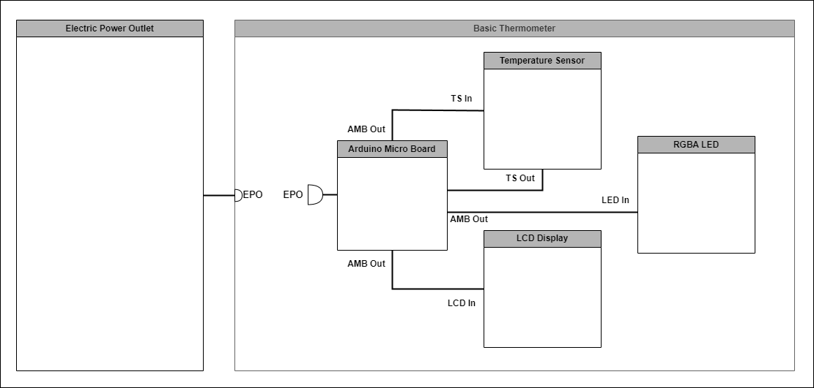
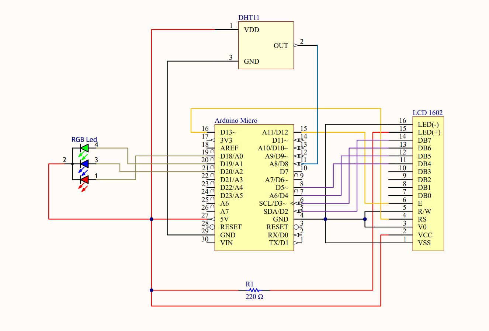

# Basic Thermometer

### Summary
&nbsp;&nbsp;&nbsp;&nbsp;&nbsp;&nbsp;A basic thermometer build with Arduino using the Arduino Micro board to read the temperature and humidity.

### Description
&nbsp;&nbsp;&nbsp;&nbsp;&nbsp;&nbsp;The device will read the temperature and humidity from the DHT 11 sensor. Afterware, it will display the data in the LCD 1602 and at the same time it will have an RGB Led that will change it color depending on the temperature. For the RGB Led I build a class to make it easy to use and export it as a library. 

### Tools & Technologies
* Hardware & Software - [Arduino](https://www.arduino.cc/)
* CAD - [Autodesk Fusion](https://www.autodesk.com/products/fusion-360/overview)
* Electronic Circuit Design - [Circuit Maker](https://circuitmaker.com/)
* Language - [C++](https://cplusplus.com/)

### Funtional Architecture

### Electronic Circuit Schematic

### 3D Model

 

### Thermometer Images

 

## Code

### Importing Libraries and Defining variables 
    #include <LiquidCrystal.h>
    #include <TemperatureLed.h>
    #include <DHT.h>

    #define LCD_CONTRAST_PIN 6
    #define LCD_BACKLIGHT_PIN 10

    #define DHT_TYPE DHT11
    #define DHT_PIN 8

    #define RED_PIN 18
    #define GREEN_PIN 19
    #define BLUE_PIN 20

### Creating the Objects
    LiquidCrystal lcd(13, 12, 5, 4, 3, 2);  
    TemperatureLed led(RED_PIN, GREEN_PIN, BLUE_PIN);
    DHT dht(DHT_PIN, DHT_TYPE);

### Setup function
    void setup() {  

        Serial.begin(9600);

        // Temperature Sensor Begin
        dht.begin();

        pinMode(9, OUTPUT);

        analogWrite(9, 100);

        analogWrite(LCD_BACKLIGHT_PIN, 255);

        analogWrite(LCD_CONTRAST_PIN, 150);

        // Display Begin
        lcd.begin(16, 2);

        // Led Begin
        led.begin();
    }

### Loop function
    void loop() {  

        // Read sensor data
        float humidity = dht.readHumidity();

        float fahrenheit = dht.readTemperature(true);

        // This Condition Section verify the temperature and then change the Led color
        if(fahrenheit <= 68.5) {

            led.changeLedColor(led.blueColor);

        } else if((fahrenheit >= 68.6) && (fahrenheit <= 72.5)) {
            
            led.setCustomLedColor(0, 255, 255);

        } else if((fahrenheit >= 72.6) && (fahrenheit <= 76.5)) {
            
            led.changeLedColor(led.greenColor);

        } else if((fahrenheit >= 76.6) && (fahrenheit <= 80.5)) {
            
            led.setCustomLedColor(255, 255, 0);

        } else if(fahrenheit >= 80.6) {
            
            led.changeLedColor(led.redColor);
        }

        // LCD print Section
        lcd.setCursor(0, 0);

        lcd.print("Temp: ");
        lcd.print(fahrenheit, 0);
        lcd.print((char)223);
        lcd.print("F");

        lcd.setCursor(0, 1);

        lcd.print("Humidity: ");
        lcd.print(humidity, 0);
        lcd.print("%");

        delay(10000);
    }

### The class for the RGB Led is build 
    class RGBLed
    {
        public:
            RGBLed(int redPin, int greenPin, int bluePin);
            int redColor[3] = {255,0,0};
            int greenColor[3] = {0,255,0};
            int blueColor[3] = {0,0,255};

            void begin();
            void changeLedColor(int color[3]);
            void setCustomLedColor(int redColor, int greenColor, int blueColor);

        private:
            int _redPin;
            int _greenPin;
            int _bluePin;
    };

### Here in the constructor the pins are assigned
    RGBLed::RGBLed(int redPin, int greenPin, int bluePin) {
        _redPin = redPin;
        _greenPin = greenPin;
        _bluePin = bluePin;
    }

### This function set the pins to Output
    void RGBLed::begin() {
        pinMode(_redPin, OUTPUT);
        pinMode(_greenPin, OUTPUT);
        pinMode(_bluePin, OUTPUT);
    }

### This function change the Led Color with predefined colors
    void RGBLed::changeLedColor(int color[3]) {
        analogWrite(_redPin, color[0]);
        analogWrite(_greenPin, color[1]);
        analogWrite(_bluePin, color[2]);
    }

### This function change the color to the color we want
    void RGBLed::setCustomLedColor(int redColor, int greenColor, int blueColor) {
        analogWrite(_redPin, redColor);
        analogWrite(_greenPin, greenColor);
        analogWrite(_bluePin, blueColor);
    }
